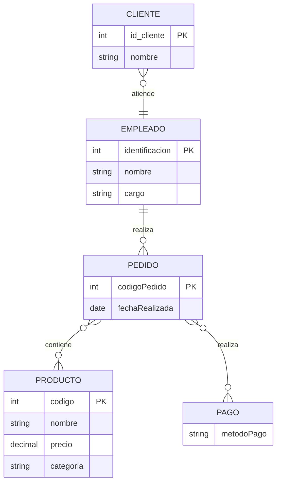

# Caso de Estudio para un Modelo Entidad-Relación (MER)

## Prompt

> **Generar un caso de estudio para un negocio de comidas rápidas, orientado a usarse como contexto y base en la creación de un Modelo Entidad-Relación (MER). El caso debe ser sencillo, incluir el contexto del negocio y un conjunto de reglas de negocio que permitan identificar entidades, atributos y relaciones.**

---

## Respuesta

# Caso de estudio: Restaurante de comidas rápidas "Sabor Express"

## Contexto

**Sabor Express** es un pequeño restaurante de comidas rápidas que vende hamburguesas, perros calientes, papas fritas y bebidas.

Los clientes realizan pedidos en el mostrador. Cada pedido puede incluir uno o varios productos y se registra la fecha en que fue realizado. El sistema debe calcular el valor total del pedido según los productos y las cantidades solicitadas.

Cada producto tiene un código, nombre, precio y categoría. Un mismo producto puede formar parte de diferentes pedidos.

El restaurante cuenta con empleados que atienden a los clientes. De cada empleado se registra su identificación, nombre y cargo. Cada pedido es atendido por un solo empleado, pero un empleado puede atender muchos pedidos.

Al finalizar la compra, el cliente realiza un único pago, que puede ser en efectivo, tarjeta o transferencia.

---

## Reglas de negocio

1. Cada producto tiene un código único.
2. Un pedido debe contener al menos un producto.
3. Un producto puede estar presente en varios pedidos.
4. Cada pedido es atendido por un solo empleado.
5. Un empleado puede atender múltiples pedidos.
6. Cada pedido tiene un único pago.
7. El valor total del pedido corresponde a la suma del precio de cada producto multiplicado por la cantidad solicitada.

---

## Objetivo

A partir de este caso de estudio se espera construir un **Modelo Entidad-Relación (MER)** que permita identificar:

- Entidades.
- Atributos.
- Claves primarias.
- Relaciones entre entidades.
- Cardinalidades.
- Entidades asociativas (si son necesarias).

# Modelo Entidad-Relación (MER)

## Relaciones

| Relación | Cardinalidad |
|-----------|--------------|
| Cliente — atiende — Empleado | N:1 |
| Empleado — realiza — Pedido | 1:N |
| Pedido — contiene — Producto | N:M |
| Pedido — realiza — Pago | N:M |
